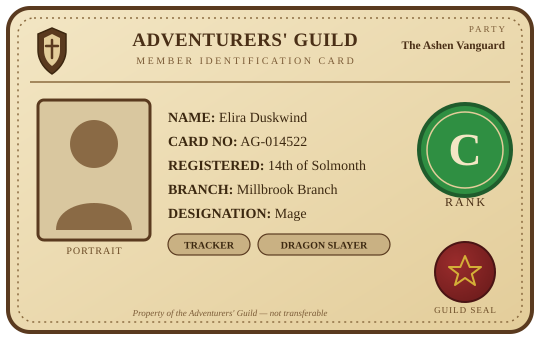
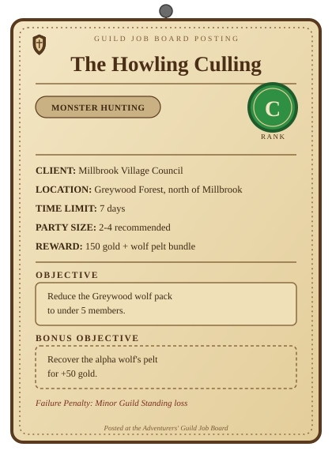

# Adventurers' Guild

## Overview

The Adventurers' Guild is the hub connecting registered adventurers and parties
with paid work: missions posted by settlements, merchants, nobles, and the guild
itself. It doesn't replace the profession/rank systems elsewhere in this repo —
it organizes them into a job pipeline. Guild leadership (Guild Master, Guild
Officer, Guild Treasurer, Guild Recruiter) is already defined in `professions.md`
under `Guild: Leadership`; the adventurer archetypes who take guild work
(Adventurer, Explorer, Treasure Hunter, Dungeon Delver, Monster Hunter, Bounty
Hunter) are defined under `Exploration: Adventurers` in the same file. This file
covers registration, party mechanics, the mission board, and guild facilities.

## Registration

* **Requirements**
    * Minimum Age: Guild-set minimum, waived with guardian sign-off
    * Registration Fee: Small one-time fee, covers the first Guild Card
    * Background Check: Guild checks for outstanding bounties or blacklist status
    * Oath: New members swear to the Guild Charter (no client betrayal, no
      mission fraud, honor the rank system)
* **Guild Card**
    * Magically-imbued identification proving membership and current rank —
      see the Guild Card section below for what's on it
    * Required to accept a mission or claim a reward at any branch
    * Lost Card Replacement: Fee scales with adventurer rank
* **What Registration Grants**
    * Job Board Access: Can view and accept missions at or below current rank
    * Guild Hall Access: Use of training grounds, bank, tavern, and healer's ward
    * Party Registration: Can found or join a registered party
    * Branch Portability: A card is valid at any guild branch, not just the one
      where it was issued

## Guild Card

The Guild Card is a magically-imbued, tamper-proof card bound to one adventurer.
It's the physical proof of registration — required to accept a mission or claim
a reward at any branch — and it updates itself automatically as the guild
records new missions against its owner.

**Card Contents** (the text/fields printed or imbued on the card):

* **Guild Card**
    * Guild Emblem: The issuing guild's crest, printed across the top
    * Adventurer Name: The registered member's name
    * Card Number: Unique per-adventurer registration ID
    * Rank: The S–F letter (see `rank.md`), shown large and prominent
    * Primary Designation: The adventurer's main role — Warrior, Mage, Ranger,
      Healer, and so on. This can change over time as the adventurer's focus
      shifts; the card reflects their current one, not a locked-in class
    * Special Designations: Earned titles or notable skills granted by the
      guild for standout feats — e.g. Tracker, Dragon Slayer. An adventurer can
      hold none, one, or several at once
    * Party Affiliation: The adventurer's current registered party name, if
      any — blank/absent for solo adventurers. Shown top-right, level with the
      guild emblem, so it reads at a glance
    * Portrait: A magically-imprinted likeness taken at registration
    * Registration Date: When the card was first issued
    * Issuing Branch: The home branch that registered the adventurer
    * Guild Seal: An anti-forgery magic sigil unique to genuine guild-issued cards
    * Guild Standing: Tracked on the card, but **not printed as visible text** —
      staff read it with a scan/spell at a branch desk rather than it being
      exposed to anyone who simply looks at the card

**Card Face Layout** — top band holds the guild emblem and guild name on the
left/center, with Party Affiliation in the top-right corner at the same level
as the emblem; the portrait sits in a box on the left; a large rank-letter
badge sits on the right, below the party affiliation; name, card number,
registration date, issuing branch, and Primary Designation run as text lines
down the middle; Special Designations appear as small tag/badge chips beneath
that text block; the guild seal sits bottom-right, styled like a wax seal. The
rank badge's color reuses `rank.md`'s existing per-rank Visual Color (S
Gold/Rainbow, A Purple, B Blue, C Green, D Yellow, E Orange, F Red/Gray) rather
than a new scheme.

Worked example:

```markdown
* **Guild Card**
    * Guild Emblem: Adventurers' Guild crest
    * Adventurer Name: Elira Duskwind
    * Card Number: AG-014522
    * Rank: C Rank
    * Primary Designation: Mage
    * Special Designations: Tracker, Dragon Slayer
    * Party Affiliation: The Ashen Vanguard
    * Portrait: (imprinted at registration)
    * Registration Date: 14th of Solmonth
    * Issuing Branch: Millbrook Branch
    * Guild Seal: (anti-forgery sigil)
```



## Adventurer Rank

Ranks reuse the S–F tier scale already defined in `rank.md` ("Quests & Missions"
and "Player Skill Level") rather than a separate scale — a mission's Rank field
and an adventurer's Rank are the same seven tiers. Guild-specific meaning per rank:

- **S Rank**: Guild Legend. Unlimited mission access, including S-Rank
  (world-threatening) requests. Guild fees waived. May be summoned directly by
  nobility or royalty.
- **A Rank**: Elite. Access to A-Rank missions and below. Reduced guild fees,
  private quarters at major guild halls.
- **B Rank**: Veteran. Access to B-Rank missions and below. Priority job board
  placement, may lead mixed-rank parties.
- **C Rank**: Adventurer. Access to C-Rank missions and below. Standard active
  member.
- **D Rank**: Journeyman. Access to D-Rank missions and below. Must pass a
  rank-up trial (set by a Rank Assessor) to advance.
- **E Rank**: Novice. Access to E-Rank missions and below. Group hunting
  missions require an escorting mentor or higher-rank party member.
- **F Rank**: Trainee. Access to F-Rank missions only (tutorial/fetch work),
  plus single, low-threat monster hunts (a lone rat or slime) — the kind of
  job an experienced adventurer won't bother picking up. Newly registered;
  group combat missions are forbidden until D Rank.

## Party System

* **Party Formation**
    * Minimum Rank: None — a party can be founded or joined from F Rank
      onward; there's no personal rank requirement to team up
    * Party Size: 1-6 members; solo mission-taking (going out alone, not
      forming a party) is restricted to C Rank and up for safety reasons
    * Party Registration: A party registers under a shared Party Name and gets
      a single Party Rank for the purpose of accepting missions
    * Mixed-Rank Parties: Members may hold different personal ranks; see Party
      Rank below for how that's resolved
* **Party Roles**
    * Vanguard: Front-line melee, absorbs and redirects enemy attention
    * Striker: Primary melee or ranged damage dealer
    * Support: Healing, buffs, and debuffs
    * Scout: Reconnaissance, traps, and stealth work
    * Quartermaster: Manages party supplies, loot logistics, and reward splits
* **Party Rank**
    * A party's effective Rank is the average of its active members' personal
      ranks, capped at one tier above its lowest-ranked member — a party can't
      carry a Trainee into an A-Rank mission just by averaging
* **Reward Split**
    * Equal Split: Default — reward divided evenly among active members present
      at mission completion
    * Leader Bonus: The registered party leader receives an extra 10% of the
      base reward for coordination
    * Guild Tax: The guild withholds 5-15% of the reward, scaling with mission
      rank, to fund guild operations
* **Disbanding**
    * Voluntary Disband: No penalty if no mission is currently active
    * Mid-Mission Abandonment: Every member who walks away from an accepted
      mission takes a Guild Standing penalty (see Guild Standing & Penalties)

## Mission Board

* **Monster Hunting**: Culling or eliminating creatures endangering people or
  livestock — from a single rat or slime (F Rank) up to an ancient dragon (S Rank)
* **Gathering**: Harvesting, mining, or logging resources for a client or the guild
* **Delivery**: Transporting goods, letters, or valuables between locations
* **Escort**: Protecting a person, caravan, or shipment along a route
* **Item Requisition**: Crafting and delivering a specific item to a client's
  spec — anything from alchemy potions to building tools
* **Investigation**: Gathering information, locating missing persons, or scouting threats
* **Rescue**: Recovering hostages or stranded people from danger
* **Labor & Construction**: Manual work, repairs, and odd jobs for a community
* **Exploration**: Mapping uncharted territory or clearing hazards from a dungeon

## Mission List

* **Monster Hunting: Single Target** (spans every rank — one creature, scaled
  to how dangerous that one creature is; see `rank.md`'s Creatures & Monsters tier)
    * Rat/Slime Extermination (F Rank): A single rat or slime bothering a
      home or shop — trivial work, the kind experienced adventurers ignore
    * Goblin Removal (E Rank): A lone goblin raider spotted near a farm
    * Ogre Takedown (D Rank): A single ogre harassing travelers on a back road
    * Troll Bridge Clearing (C Rank): One troll blocking a trade route
    * Young Dragon Hunt (B Rank): A young dragon that's taken up nesting near a settlement
    * Adult Dragon Slaying (A Rank): An adult dragon terrorizing a region
    * Ancient Dragon Slaying (S Rank): An ancient dragon threatening the realm
* **Monster Hunting: Extermination**
    * Goblin Camp Culling: Clear a goblin encampment threatening a nearby village
    * Wolf Pack Thinning: Reduce a wolf pack's numbers before winter migration
    * Rabid Beast Bounty: Track and put down a diseased animal attacking livestock
* **Monster Hunting: Bounty**
    * Named Monster Bounty: Hunt a specific dangerous creature under a guild-issued poster
    * Rogue Adventurer Bounty: Apprehend or subdue a guild member turned criminal
* **Item Requisition: Alchemy**
    * Potion Stockpile Order: Brew and deliver a batch of healing or utility potions
    * Custom Elixir Commission: Craft a specific essence-based item to a client's spec
* **Item Requisition: Crafted Goods**
    * Toolset Commission: Craft and deliver a set of building or farming tools for a settlement
    * Weapon Order: Forge and deliver a specific weapon to a client's spec
* **Gathering: Harvest**
    * Herb Collection Run: Gather medicinal herbs for the guild's healers
    * Rare Flora Retrieval: Collect a specific magical plant from a dangerous biome
* **Gathering: Mining**
    * Ore Vein Extraction: Mine a quota of ore from a claimed vein
    * Gem Prospecting: Search a cave system for valuable gemstones
* **Delivery: Courier**
    * Sealed Letter Delivery: Carry time-sensitive correspondence between guild branches
    * Merchant Supply Run: Transport trade goods between towns
* **Delivery: High-Value**
    * Alchemical Reagent Transport: Move volatile or valuable materials with care
* **Escort: Caravan**
    * Trade Caravan Escort: Guard a merchant caravan through bandit territory
    * Pilgrimage Escort: Protect pilgrims traveling to a sacred site
* **Escort: VIP**
    * Noble Protection Detail: Guard a noble or dignitary during travel
* **Investigation: Reconnaissance**
    * Scout Enemy Movements: Observe and report on hostile activity without engaging
    * Missing Person Search: Investigate the disappearance of a local resident
* **Rescue: Search and Rescue**
    * Stranded Traveler Recovery: Locate and retrieve travelers lost in the wilds
    * Hostage Extraction: Free captives held by bandits or monsters
* **Labor & Construction: Odd Jobs**
    * Bridge Repair: Assist in repairing storm-damaged infrastructure
    * Wall Reinforcement: Help fortify a settlement's defenses ahead of a raid
* **Exploration: Dungeon**
    * Uncharted Ruin Survey: Map and report on a newly discovered ruin
    * Dungeon Hazard Clearing: Clear traps and weak monsters to make a dungeon safe

## Mission Entry Template

Use this Label:value block for adding a new concrete mission listing (same family
as `alchemy.md`'s recipe entries and `spellconstruction.md`'s worked examples):

```markdown
* **Mission Name**
    * Client: Who is requesting it (NPC, faction, or "Guild")
    * Rank: Difficulty tier (see rank.md — Quests & Missions)
    * Category: Which Mission Board category this belongs to
    * Location: Where the mission takes place
    * Reward: Payment, plus any bonus items
    * Time Limit: Deadline, or "None" if open-ended
    * Recommended Party Size: e.g. "2-4"
    * Objective: What must be done to complete the mission
    * Failure Penalty: Consequence of failing or abandoning (see Guild Standing & Penalties)
    * Bonus Objective (optional): Extra optional goal for additional reward
```

Worked example:

```markdown
* **The Howling Culling**
    * Client: Millbrook Village Council
    * Rank: C Rank
    * Category: Monster Hunting
    * Location: Greywood Forest, north of Millbrook
    * Reward: 150 gold + wolf pelt bundle
    * Time Limit: 7 days
    * Recommended Party Size: 2-4
    * Objective: Reduce the Greywood wolf pack to under 5 members
    * Failure Penalty: Minor Guild Standing loss
    * Bonus Objective: Recover the alpha wolf's pelt for +50 gold
```



## Guild Services & Facilities

* **Job Board**
    * Function: Physical or magical board listing open missions, filterable by rank
    * Location: Just inside the Guild Hall entrance, for easy public access
    * Posting Rights: Guild staff and vetted clients may post; adventurers may
      only accept, not post
* **Guild Hall**
    * Function: Central building housing the job board, front-of-house staff,
      and common/meeting areas
    * Staff Housing: Provides lodging for internal guild staff (Receptionist,
      Rank Assessor, Mediator, etc.) — this is staff-only and separate from
      Guild Lodgings below, which houses adventurers instead
    * Archives: Keeps mission history, guild card records, and Guild Standing files
* **Guild Lodgings**
    * Function: Rooms and small houses the guild rents or grants to registered
      adventurers — not to be confused with the Guild Hall's staff housing above
    * Room Tiers: Shared bunkroom (cheapest) up to a private house, priced by
      rank and availability
    * Party Housing: A party may rent a single shared house instead of
      individual rooms
    * Eligibility: Open to any registered member; higher rank or Guild Standing
      improves priority and discounts, not access
* **Butcher's Yard** (name not finalized — working title for monster-carcass processing)
    * Function: Adventurers turn in monster carcasses here instead of hauling
      or disposing of them personally
    * Meat Processing: Edible creatures are processed into meat for the local
      food supply — e.g. an orc carcass becomes orc meat for the market
    * Byproduct Recovery: Depending on the monster, processing may also yield
      alchemy-usable parts (hides, organs, essences) handed back to the
      adventurer; see `item.md`'s Organic Parts group and `alchemy.md`'s
      Creature Parts tier for what those parts feed into
    * Processing Fee: The guild charges a fee for the service, scaled to the
      monster's type, size, and rank
* **Requisitions Shop**
    * Function: Guild-run store selling basic gear and consumables
    * Member Discount: Registered adventurers buy at a reduced price
    * Loan Program: The Quartermaster (Guild) may loan starter equipment against
      a future mission reward
* **Bank & Vault**
    * Function: Secure storage for adventurer earnings and valuables
    * Branch Access: Funds deposited at one branch are withdrawable at any other
    * Party Accounts: A registered party may hold a shared vault for pooled earnings
* **Training Grounds**
    * Function: Practice area for combat drills and rank-up trials
    * Supervision: Rank-up trials are overseen by a Rank Assessor
    * Open Practice: Free to use for sparring and skill practice outside of trials
* **Healer's Ward**
    * Function: On-site medical care for injured adventurers
    * Priority Care: Adventurers injured mid-mission are treated first, free of charge
    * Standing Care: Routine treatment is available to any member for a fee
* **Transportation Services**
    * Function: Guild-arranged travel or teleportation between branches
    * Mission Transport: Discounted or free transport when travel is part of an accepted mission
    * Booking: Arranged through the Receptionist ahead of departure
* **Tavern & Rest Area**
    * Function: Social space for meals, rest, and informal party recruitment
    * Notice Wall: Informal corkboard for adventurers seeking party members,
      separate from the official Job Board
    * Rumor Mill: A common source of unofficial leads that can turn into
      Investigation-category missions

## Guild Standing & Penalties

Guild Standing reuses `rank.md`'s Faction Reputation tiers, but it is a
**separate axis from Adventurer Rank**. Adventurer Rank measures skill and
experience (an F-Rank Trainee is simply new or untrained, not untrustworthy);
Guild Standing measures the guild's trust in an adventurer's *conduct*. A brand
-new member starts at Neutral standing regardless of how low their Adventurer
Rank is — standing only drops toward Hostile through misconduct: hurting
people, theft, fraud, or similar behavior that makes the guild treat the
adventurer or party as an actual threat, not through inexperience.

- **S Rank Standing (Exalted)**: Guild treats the adventurer as a flagship member;
  first pick of high-reward missions
- **A Rank Standing (Revered)**: Trusted with sensitive or high-value missions
- **B Rank Standing (Honored)**: Reliable member, occasional fee discounts
- **C Rank Standing (Friendly)**: Default standing for an active member in good order
- **D Rank Standing (Neutral)**: Starting standing for every newly registered
  member (independent of Adventurer Rank), or a member recovering from a past penalty
- **E Rank Standing (Unfriendly)**: Restricted to lower-rank missions until standing recovers
- **F Rank Standing (Hostile)**: Earned through real misconduct — violence
  against clients or civilians, theft, fraud — not through being new or
  low-ranked; suspended or blacklisted, cannot accept missions

**Penalties**
* **Mission Failure**: Minor Guild Standing loss; reward forfeited
* **Mission Abandonment**: Larger Guild Standing loss, applied to every party
  member who left; repeat offenses risk suspension
* **Fraud or Client Betrayal**: Immediate drop to Hostile standing and guild card
  revocation
* **Emergency Quests**: At Honored standing or above, an adventurer may be called
  on for a mandatory Emergency Quest (regional threat); refusing costs Guild Standing

## Guild Roles (Front-of-House)

Guild leadership (Guild Master, Guild Officer, Guild Treasurer, Guild Recruiter)
is defined in `professions.md` under `Guild: Leadership` — the roles below are the
operational staff specific to running a mission board that aren't covered there.

* **Guild Staff**
    * Receptionist: Registers new members and assigns missions from the board
    * Rank Assessor: Evaluates adventurers and parties for rank-up trials
    * Mediator: Resolves disputes between adventurers, parties, or clients
    * Quartermaster (Guild): Manages the Requisitions Shop and equipment loans

## Other Guilds

`professions.md`'s `Guild: Types` group names four other guilds besides the
Adventurers' Guild: the Thieves' Guild, Assassins' Guild, Merchant Guild, and
Mages' Guild. The Adventurers' Guild is the largest by membership and the one
every other guild routes outside work through — so it trades and interacts
with all of them regularly. These other guilds reuse a couple of Adventurers'
Guild concepts (an internal rank system, membership cards) but are narrow and
specialized rather than broad and generic like the Adventurers' Guild — none of
them run their own public job board or party system; instead they post to,
hire through, or quietly go around the Adventurers' Guild when they need
outside hands.

Guild-sourced work reaches an adventurer three ways:

* **Public Postings**: Ordinary jobs a guild openly posts to the Adventurers'
  Guild's Job Board, same as any other client — these use the normal Mission
  Board categories and Mission Entry Template
* **Private Missions**: Jobs contracted quietly, guild-to-guild, without going
  on the open board — usually offered only to adventurers with an existing
  relationship or reputation with that guild
* **Secret Missions**: Off-the-books jobs offered only to specifically trusted
  or aligned adventurers. Legality depends entirely on the guild and the job —
  some are merely confidential, others are outright illegal — and taking one
  risks the adventurer's own Guild Standing if it's ever discovered (see Guild
  Standing & Penalties)

* **Thieves' Guild**
    * Focus
        * Information brokering and rumor networks
        * Smuggling and fencing stolen or contraband goods
        * Lock, trap, and vault security circumvention
    * Leadership: Thieves' Guild Master (see `professions.md` — Guild: Types)
    * Public Postings: Rare — occasionally posts an above-board courier or
      locksmith job when it needs legitimate-looking labor
    * Private Missions: Discreet retrieval (recover a specific item without a
      trace), surveillance, information gathering
    * Secret Missions: Burglary and blackmail-material acquisition —
      illegal in most jurisdictions; offered only to adventurers with
      established underworld trust
* **Assassins' Guild**
    * Focus
        * Contract killing and bounty elimination (as opposed to bounty
          *capture*, which is Adventurers' Guild territory)
        * Sabotage of people, property, or operations
        * Poison craft and untraceable methods
    * Leadership: Assassins' Guild Master (see `professions.md` — Guild: Types)
    * Public Postings: Effectively none — the guild avoids the open board entirely
    * Private Missions: Elimination contracts on named targets, often
      disguised to outsiders as "monster hunting" or "bodyguard" work
    * Secret Missions: Assassination of political or noble targets — illegal
      almost everywhere; accepting one can flip an adventurer's Guild Standing
      toward Hostile if it's exposed
* **Merchant Guild**
    * Focus
        * Trade regulation and market price-setting
        * Caravan logistics and trade-route management
        * Tariffs and trade agreements between settlements
    * Leadership: Merchant Guild Leader (see `professions.md` — Guild: Types)
    * Public Postings: Frequent — the guild is the largest source of Delivery,
      Escort, and Item Requisition postings on the Job Board
    * Private Missions: Priority contracts for favored, repeat-client
      adventurers — bulk supply runs, rush orders, trade-route scouting
    * Secret Missions: Corporate espionage (undercutting or sabotaging a rival
      merchant house, moving untaxed goods) — legally gray rather than
      outright criminal; legality depends on local trade law and how far it goes
* **Mages' Guild**
    * Focus
        * Magical research and arcane artifact study
        * Spellcasting regulation and licensing
        * Mentorship and training of spellcasters
    * Leadership: Mages' Guild Archmage (see `professions.md` — Guild: Types)
    * Public Postings: Occasional — rare-reagent gathering missions and escort
      duty for traveling scholars
    * Private Missions: Commissioned research assistance, arcane hazard
      containment, testing experimental enchantments
    * Secret Missions: Forbidden research (necromancy, banned magic schools)
      or experimentation on unwilling subjects — illegal and ethically
      fraught; offered only to adventurers whose alignment or history suggests
      they won't report it
